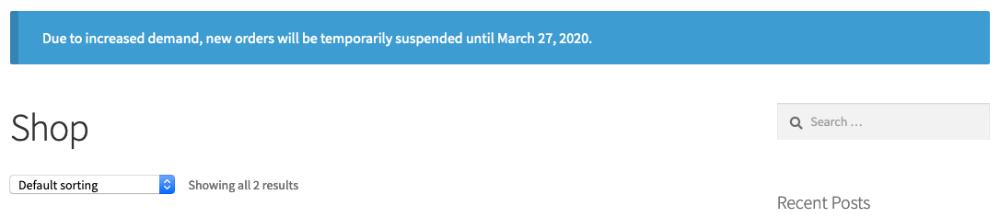
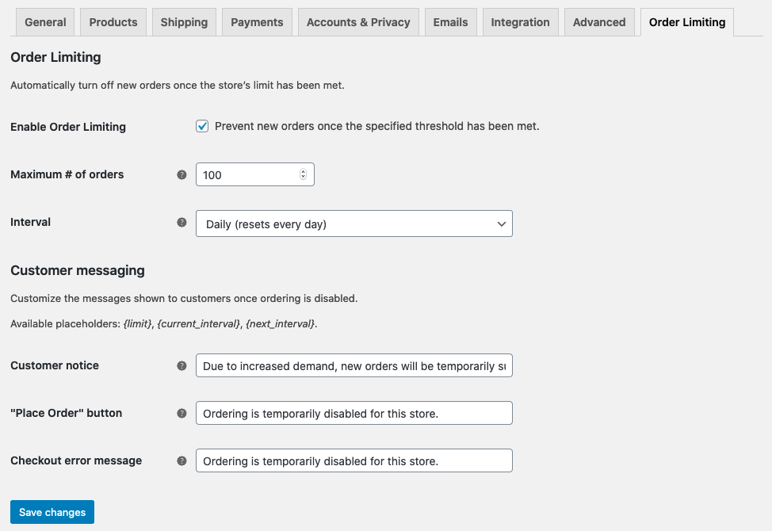

# Limit Orders for WooCommerce

While many stores would be thrilled to have a never-ending order queue, some store owners are faced with the opposite problem: how can I make sure I don't get overwhelmed by _too many_ orders?

Limit Orders for WooCommerce lets you limit the number of orders your store will accept per day, week, or month, while giving you full control over the messaging shown to your customers when orders are no longer being accepted. Once limiting is in effect, "Add to Cart" buttons and the checkout screens will automatically be disabled.

## Requirements

* WordPress 5.2 or newer
* WooCommerce 3.9 or newer
* PHP 7.0 or newer

## Installation

1. [Download and extract a .zip archive of the plugin]() (or clone this repository) into your site's plugins directory (`wp-content/plugins/` by default).
2. Activate the plugin through the Plugins screen in WP Admin.
3. [Configure the plugin](#Configuration).

## Configuration

Configuration for Limit Orders for WooCommerce is available through WooCommerce &rsaquo; Settings &rsaquo; Order Limiting:

<dl>
	<dt>Enable Order Limiting</dt>
	<dd>Check this box to enable order limiting.</dd>
	<dd>Should you ever want to disable the limiting temporarily, simply uncheck this box.</dd>
	<dt>Maximum # of orders</dt>
	<dd>Customers will be unable to checkout after this number of orders are received.</dd>
	<dd>Shop owners will still be able to create orders via WP Admin, even after the limit has been reached.</dd>
	<dt>Interval</dt>
	<dd>How often the limit is reset. By default, this can be "daily", "weekly", or "monthly".</dd>
	<dd>When choosing "weekly", the plugin will respect the value of <a href="https://wordpress.org/support/article/settings-general-screen/#week-starts-on">the store's "week starts on" setting</a>.</dd>
</dl>

### Messaging

Limit Orders for WooCommerce lets you customize the messages shown on the front-end of your store:

<dl>
	<dt>Customer notice</dt>
	<dd>This notice will be added to all WooCommerce pages on the front-end of your store once the limit has been reached.</dd>
	<dt>"Place Order" button</dt>
	<dd>If a customer happens to visit the checkout screen after the order limit has been reached, this message will replace the "Place Order" button.</dd>
	<dt>Checkout error message</dt>
	<dd>If a customer submits an order after the order limits have been reached, this text will be used in the resulting error message.</dd>
</dl>

#### Variables

In any of these messages, you may also use the following variables:

<dl>
	<dt>{limit}</dt>
	<dd>The maximum number of orders accepted.</dd>
	<dt>{current_interval}</dt>
	<dd>The date the current interval started.</dd>
	<dt>{next_interval}</dt>
	<dd>The date the next interval will begin (e.g. when orders will be accepted again).</dd>
</dl>

Both `{current_interval}` and `{next_interval}` will be formatted [according to the "date format" setting for your store](https://wordpress.org/support/article/settings-general-screen/#date-format).
